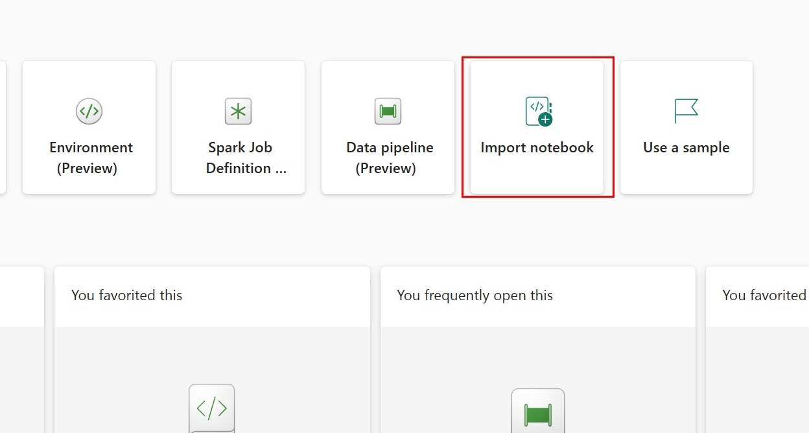
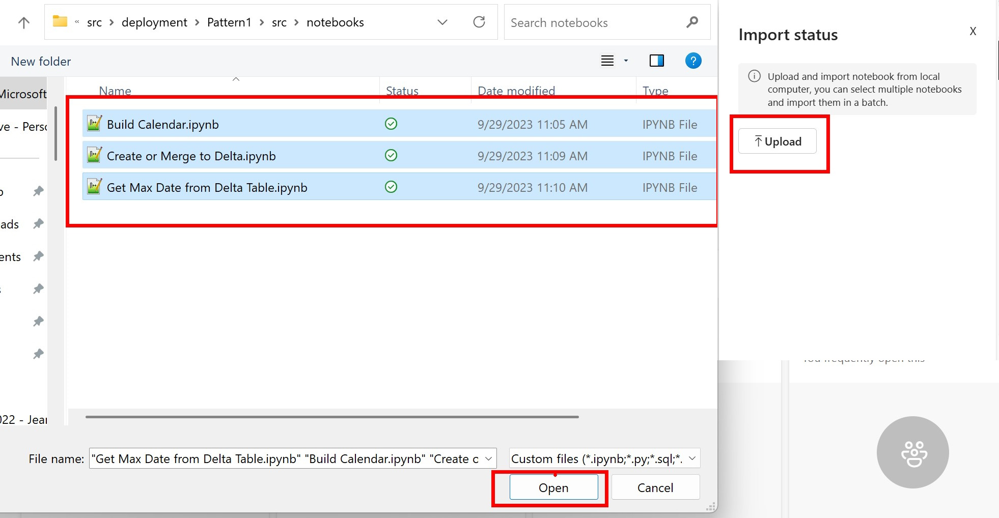

## Descrizione
Le pipeline basate sui metadati in Azure Data Factory, Synapse Pipelines e ora in Microsoft Fabric ti offrono la possibilità di inserire e trasformare i dati con meno codice, manutenzione ridotta e maggiore scalabilità rispetto alla scrittura di codice o pipeline per ogni entità di origine dati che deve essere ingerito e trasformato. La chiave sta nell'identificare i modelli di caricamento e trasformazione dei dati per le origini e le destinazioni dei dati e quindi creare la struttura per supportare ciascun modello.

## Creare le Azure Resource
Creare un Azure Resource Group, un Storage Account e l'Azure SQL DBs necessario. 
### Creare un Azure Resource group 

Se necessario, per creare il gruppo di risorse.
### Creare un Azure Storage account
Create un blob storage account nel resource group creato prima. Questo verrà utilizzato per ripristinare il database Wide World Importers.

### Creare un Azure SQL Server
La schermata dovrebbe essere simile a quella qui sotto: 
Andre sulla tab del  **Networking**  e modificare le Regole firewall in **Yes** per consentire ai servizi e alle risorse di Azure di accedere a questo server.

### Crea un Azure SQL DB per le configurazione della Metadata Driven Pipeline
1. seguire le istruzioni dell'immagine per la creazione 
2. usare come nome di database  **FabricMetadataOrchestration** 
3. Come **Workload environment** scegliere **Development**
4. Mentre nella scheda **Networking** sotto **Firewall rules**, aggiungere l'ip **Add current client IP address** to **Yes** 
5. Cliccare su **Review and create**
   
### Download e restore del database Wide World Importers Database
1. Download del database Wide World Importers per Azure SQL DB. [Click here to immediately download the bacpac](https://github.com/Microsoft/sql-server-samples/releases/download/wide-world-importers-v1.0/WideWorldImporters-Standard.bacpac)
1.Caricare il bacpac nello  storage account creato precedentemente e restore del database Wide World Importers. [Follow the instructions here](https://learn.microsoft.com/en-us/azure/azure-sql/database/database-import?view=azuresql&tabs=azure-powershell),

## Creare gli oggetti in Azure SQL DB
Prima le viste scaricando da qui lo script [in this repo](src/sql/1-wwi/create_source_views.sql). Dopo l'eseguzione degli script dobbiamo avere questa situazione 

### Caricare le tabelle del database che contiene i metadati
Scarichiamo ed eseguiamo lo script che trovate qui [in this repo](src/sql/2-metadatadb/create-metadata-tables.sql) Il risultato finale sarà il seguente: 
Notare i valori per le colonne **loadtype**, **sqlsourcedatecolumn**, **sqlstartdate** e **sqlenddate** della tabella **PipelineOrchestrator_FabricLakehouse**. Per le tabelle con **loadtype** uguale a '**incremental**', verranno caricati solo 1 settimana di dati. Questo perché queste tabelle sono molto grandi, quindi a scopo di test abbiamo bisogno solo di una piccola quantità di dati. Dopo che queste tabelle sono state caricate in Lakehouse, **sqlstartdate** verrà aggiornato alla data massima di ciascuna colonna indicata nella colonna sqlsourcedate per ogni tabella. Ciò significa che se esegui nuovamente la pipeline senza reimpostare **sqlenddate**, nessun nuovo dato verrà aggiunto alle tabelle caricate in modo incrementale. Potresti essere tentato di impostare **sqlenddate** su NULL, che è il valore per i carichi pianificati in produzione, ma ti metterei in guardia dal farlo in questa soluzione senza testare la durata del caricamento dal database World Wide Importers a Lakehouse corre. Aggiorna invece **sqlenddate** per aggiungere solo pochi giorni di dati in più dopo l'esecuzione iniziale dei dati di una sola settimana per testare la logica di caricamento incrementale.

## Creazione delle risorse di Microsoft Fabric 
Creazione di un workspace di Fabric, Lakehouses, Data Warehouse, e delle connessioni Azure SQL DB. Quindi bisogna prima creare un workspace di Fabric [Create a Fabric Workspace](https://learn.microsoft.com/en-us/fabric/get-started/create-workspaces) poi passeremo alla creazione di due lakehouse per il livello bronze e gold [Create 2 Microsoft Fabric Lakehouses](https://learn.microsoft.com/en-us/fabric/data-engineering/create-lakehouse) nel workspace. Dopo aver creato il lakehouse copiarsi il riferimento  URLsdelle tabelle come mostra sotto  dovrebbe essere una cosa simile **abfss://\<uniqueid>@onelake.dfs.fabric.microsoft.com/a\<anotheruniqueid>** .
Successivamente vi sarà la creazione del Fabric Data warehouse seguendo le indicazioni che si vedono nell'immagine sotto [istruzioni](https://learn.microsoft.com/en-us/fabric/data-warehouse/create-warehouse).

Abbiamo bisogno di un Data Warehouse perchè ,anche se le visualizzazioni possano essere create su Lakehouse in Fabric, queste visualizzazioni non sono esposte nell'attività di copia dati, almeno al momento della stesura di questo documento. Pertanto dobbiamo creare le viste nel Fabric Data Warehouse per entrambi i modelli. 

Prima di proseguire dobbiamo creare una connessione al database Wide World Importers e al FabricMetadataConfiguration seguendo queste istruzioni [istruzioni](https://learn.microsoft.com/en-us/fabric/data-factory/connector-azure-sql-database).

### Caricamento dei Notebooks Spark su Fabric
1. Scarica i 3 notebooks [dentro il repository](src/notebooks/)
2. **Import notebook** e poi selezionare i file da caricare 

## Creazione della Pipelines per caricare dati da World Wide Importers a Fabric Lakehouse
È importante copiare il testo esattamente così com'è per evitare errori negli script o nelle attività successive. Ecco un paio di esempi:

Le istruzioni sopra riportate ti dicono di andare nella pipeline **Parametri**, aggiungere 9 nuovi parametri di tipo stringa e copiare ciascun nome del parametro dalla tabella al nome di parametro nella pipeline.

Questa pipeline verrà chiamata da una pipeline Orchestrator per caricare una tabella dagli importatori mondiali a Fabric Lakehouse. Una volta terminata la pipeline sarà simile alla seguente: 

1. Crea una nuova Pipeline  e chiamala "**Get WWImporters Data direct**"
2. Aggiungi una attività  di **Set variable** 
3. Fare clic sull'area di disegno e aggiungere la seguente pipeline **Parameters**:

      Name                | Type   |
     ------------------- | ------ |
     sqlsourcedatecolumn | String |
     sqlstartdate        | String |
     sqlenddate          | String |
     sqlsourceschema     | String |
     sqlsourcetable      | String |
     sinktablename       | String |
     loadtype            | String |
     sourcekeycolumn     | String |
     batchloaddatetime   | String |

4.Spostati sulle  **Variables** come scheda e aggiungi le seguenti variabili: 

      Name              | Type   |
    | ----------------- | ------ |
    | datepredicate     | String |
    | maxdate           | String |
    | rowsinserted      | String |
    | rowsupdated       | String |
    | pipelinestarttime | String |
    | pipelineendtime   | String |
    
5. Configura l'attività di  **Set variable** creata al passo 2:

    | Tab      | Configuration | Value Type         | Value                 |
    | -------- | ------------- | ------------------ | --------------------- |
    | General  | Name          | String             | Set pipelinestarttime |
    | Settings | Variable type | Radio Button       | Pipeline variable     |
    | Settings | Name          | String             | pipelinestarttime     |
    | Settings | Value         | Dynamic Content | @utcnow()             |
   
6. Aggiugni un nuovo **Set variable**, e configuralo come segue:

    | Tab      | Configuration | Value Type   | Value              |
    | -------- | ------------- | ------------ | ------------------ |
    | General  | Name          | String       | Set Date predicate |
    | Settings | Variable type | Radio Button | Pipeline variable  |
    | Settings | Name          | String       | datepredicate      |
    | Settings | Value         | Dynamic Content |@if(equals(pipeline().parameters.sqlenddate,null),concat(pipeline().parameters.sqlsourcedatecolumn,' >= ''', pipeline().parameters.sqlstartdate,''''),concat(pipeline().parameters.sqlsourcedatecolumn, ' >= ''',pipeline().parameters.sqlstartdate,''' and ', pipeline().parameters.sqlsourcedatecolumn,' < ''',pipeline().parameters.sqlenddate,'''')) |
   
7. Aggiungi una attività di **If condition** e configuralo come segue:
    | Tab        | Configuration | Value Type         | Value                                          |
    | ---------- | ------------- | ------------------ | ---------------------------------------------- |
    | General    | Name          | String             | Check loadtype                                 |
    | Activities | Expression    | Dynamic Content | @equals(pipeline().parameters.loadtype,'full') |
   
8. Ora configura la parte dell' **If True**. Una volta completate, le attività di configurazione apparira così: 
       8.1. Aggiungi una attività di **Copy Data**  e configurala così:
          Tab     | Configuration   | Value Type   | Value                           |
        | ------- | --------------- | ------------ | ------------------------------- |
        | General | Name            | String       | Copy data to delta table        |
        | Source  | Data store type | Radio button | External                        |
        | Source  | Connection      | Drop down    | \<choose your World Wide Importers database connection> |
        | Source  | Connection type | Drop down    | Azure SQL Database              |
        | Source  | User query      | Radio button | Query                           |
        | Source  | Query           | Dynamic Content | select * from @{pipeline().parameters.sqlsourceschema}.@{pipeline().parameters.sqlsourcetable} where  @{variables('datepredicate')} |
        | Destination | Data store type           | Radio button       | Workspace                            |
        | Destination | Workspace data store type | Drop down          | Lakehouse                            |
        | Destination | Lakehouse                 | Drop down          | \<choose your Fabric Lakehouse>              |
        | Destination | Root folder               | Radio button       | Tables                               |
        | Destination | Table name                | Dynamic Content | @pipeline().parameters.sinktablename |
        | Destination | Advanced-> Table action   | Radio button       | Overwrite                            | 
    8.2.  Aggiungi una attività di **Notebook** e configurala così:
        | Tab      | Configuration               | Add New Parameter | Value Type         | Value                                      |
        | -------- | --------------------------- | ----------------- | ------------------ | ------------------------------------------ |
        | General  | Settings                    |                   | String             | Get MaxDate loaded                         |
        | Settings | Notebook                    |                   | Dropdown           | Get Max Data from Delta Table              |
        | Settings | Advanced -> Base parameters | lakehousePath     | String             | \<enter your Bronze Lakehouse abfss path>          |
        | Settings | Advanced -> Base parameters | tableName         | Dynamic Content | @pipeline().parameters.sinktablename       |
        | Settings | Advanced -> Base parameters | tableKey          | Dynamic Content | @pipeline().parameters.sourcekeycolumn     |
        | Settings | Advanced -> Base parameters | dateColumn        | Dynamic Content | @pipeline().parameters.sqlsourcedatecolumn |
   
    8.3. Aggiungi una attività di  **Set variable** e configurala così:
   
        | Tab      | Configuration | Value Type         | Value                                                                               |
        | -------- | ------------- | ------------------ | ----------------------------------------------------------------------------------- |
        | General  | Name          | String             | Get maxdate                                                                         |
        | Settings | Variable type | Radio Button       | Pipeline variable                                                                   |
        | Settings | Name          | Dropdown           | maxdate                                                                             |
        | Settings | Value         | Dynamic Content | @split(split(activity('Get MaxDate loaded').output.result.exitValue,'\|')[0],'=')[1] |
   
    8.4. Add another **Set variable**, drag the green arrow from the previous activity to it and configure:
        | Tab      | Configuration | Value Type   | Value             |
        | -------- | ------------- | ------------ | ----------------- |
        | General  | Name          | String       | set rows inserted |
        | Settings | Variable type | Radio Button | Pipeline variable |
        | Settings | Name          | Dropdown     | rowsinserted      |
        | Settings | Value         | Dynamic Content | @split(split(activity('Get MaxDate loaded').output.result.exitValue,'\|')[1],'=')[1] |
   
    8.5. Add another **Set variable**, drag the green arrow from the previous activity to it and configure:
        | Tab      | Configuration | Value Type         | Value                |
        | -------- | ------------- | ------------------ | -------------------- |
        | General  | Name          | String             | Set pipeline endtime |
        | Settings | Variable type | Radio Button       | Pipeline variable    |
        | Settings | Name          | Dropdown           | pipelineendtime      |
        | Settings | Value         | Dynamic Content | @utcnow()            |
   
     8.6. Add  **Script**, drag the green arrow from the previous activity to it and configure:
        | Tab      | Configuration   | Value Type   | Value                           |
        | -------- | --------------- | ------------ | ------------------------------- |
        | General  | Name            | String       | Update Pipeline Run details     |
        | Settings | Data store type | Radio Button | External                        |
        | Settings | Connection      | Dropdown     | Connection to FabricMetdataOrchestration Database |
        | Settings | Script          | Radio Button | NonQuery                        |
        | Settings | Script          | Dynamic Content  | Update dbo.PipelineOrchestrator_FabricLakehouse set batchloaddatetime = '@{pipeline().parameters.batchloaddatetime}', loadstatus = '@{activity('Copy data to delta table').output.executionDetails[0].status}', rowsread = @{activity('Copy data to delta table').output.rowsRead}, rowscopied= @{activity('Copy data to delta table').output.rowsCopied}, deltalakeinserted = '@{variables('rowsinserted')}', deltalakeupdated =0, sqlmaxdatetime = '@{variables('maxdate')}', pipelinestarttime='@{variables('pipelinestarttime')}', pipelineendtime = '@{variables('pipelineendtime')}' where sqlsourceschema = '@{pipeline().parameters.sqlsourceschema}' and sqlsourcetable = '@{pipeline().parameters.sqlsourcetable}' |
    1. Exit the **True activities** box of the **If condition** by clicking on  **Main canvas** in the upper left corner
1. Now configure the **If False** activities. Your False activities will be a flow of activities when the table to be loaded should be an incremental load. When completed, the False activities will look like this: 
    1. Add **Copy Data** activity:
        | Tab     | Configuration   | Value Type   | Value                           |
        | ------- | --------------- | ------------ | ------------------------------- |
        | General | Name            | String       | Copy data to parquet            |
        | Source  | Data store type | Radio button | External                        |
        | Source  | Connection      | Drop down    | \<choose your World Wide Importers database connection> |
        | Source  | Connection type | Drop down    | Azure SQL Database              |
        | Source  | User query      | Radio button | Query                           |
        | Source  | Query      | Dynamic Content | select * from @{pipeline().parameters.sqlsourceschema}.@{pipeline().parameters.sqlsourcetable} where  @{variables('datepredicate')} |
        | Destination | Data store type           | Radio button | Workspace               |
        | Destination | Workspace data store type | Drop down    | Lakehouse               |
        | Destination | Lakehouse                 | Drop down    | \<choose your Fabric Lakehouse> |
        | Destination | Root folder               | Radio button | Files                   |
        | Destination  | File Path (1)  | Dynamic Content | incremental/@{pipeline().parameters.sinktablename} |
        | Destination  | File Path (2)  | Dynamic Content | @{pipeline().parameters.sinktablename}.parquet |
        | Destination  | File format      | Drop down | Parquet |
    1. Add **Notebook** activity, drag the green arrow from previous activity and configure:
        | Tab      | Configuration               | Add New Parameter | Value Type         | Value                                      |
        | -------- | --------------------------- | ----------------- | ------------------ | ------------------------------------------ |
        | General  | Settings                    |                   | String             | Load to Delta                              |
        | Settings | Notebook                    |                   | Dropdown           | Create or Merge to Deltalake               |
        | Settings | Advanced -> Base parameters | lakehousePath     | String             | \<enter your Bronze Lakehouse abfss path>          |
        | Settings | Advanced -> Base parameters | tableName         | Dynamic Content | @pipeline().parameters.sinktablename       |
        | Settings | Advanced -> Base parameters | tableKey          | Dynamic Content | @pipeline().parameters.sourcekeycolumn     |
        | Settings | Advanced -> Base parameters | dateColumn        | Dynamic Content | @pipeline().parameters.sqlsourcedatecolumn |
    1. Add **Set variable**, drag the green arrow from the previous activity to it and configure:
        | Tab      | Configuration | Value Type         | Value                                                                          |
        | -------- | ------------- | ------------------ | ------------------------------------------------------------------------------ |
        | General  | Name          | String             | Get maxdate incr                                                               |
        | Settings | Variable type | Radio Button       | Pipeline variable                                                              |
        | Settings | Name          | Dropdown           | maxdate                                                                        |
        | Settings | Value         | Dynamic Content | @split(split(activity('Load to Delta').output.result.exitValue,'\|')[0],'=')[1] |
    1. Add **Set variable**, drag the green arrow from the previous activity to it and configure:
        | Tab      | Configuration | Value Type         | Value                                                                          |
        | -------- | ------------- | ------------------ | ------------------------------------------------------------------------------ |
        | General  | Name          | String             | set rows inserted incr                                                         |
        | Settings | Variable type | Radio Button       | Pipeline variable                                                              |
        | Settings | Name          | Dropdown           | rowsinserted                                                                   |
        | Settings | Value         | Dynamic Content | @split(split(activity('Load to Delta').output.result.exitValue,'\|')[1],'=')[1] |
    1. Add **Set variable**, drag the green arrow from the previous activity to it and configure:
        | Tab      | Configuration | Value Type         | Value                                                                          |
        | -------- | ------------- | ------------------ | ------------------------------------------------------------------------------ |
        | General  | Name          | String             | set rows updated incr                                                          |
        | Settings | Variable type | Radio Button       | Pipeline variable                                                              |
        | Settings | Name          | Dropdown           | rowsupdated                                                                    |
        | Settings | Value         | Dynamic Content | @split(split(activity('Load to Delta').output.result.exitValue,'\|')[2],'=')[1] |
    1. Add **Set variable**, drag the green arrow from the previous activity to it and configure:
        | Tab      | Configuration | Value Type         | Value                     |
        | -------- | ------------- | ------------------ | ------------------------- |
        | General  | Name          | String             | Set pipeline endtime incr |
        | Settings | Variable type | Radio Button       | Pipeline variable         |
        | Settings | Name          | Dropdown           | pipelineendtime           |
        | Settings | Value         | Dynamic Content | @utcnow()                 |
    1. Add  **Script**, drag the green arrow from the previous activity to it and configure:
        | Tab      | Configuration   | Value Type   | Value                                             |
        | -------- | --------------- | ------------ | ------------------------------------------------- |
        | General  | Name            | String       | Update Pipeline Run details - incremental         |
        | Settings | Data store type | Radio Button | External                                          |
        | Settings | Connection      | Dropdown     | Connection to FabricMetdataOrchestration Database |
        | Settings | Script(1)       | Radio Button | NonQuery                                          |
        | Settings | Script(2)       | Dynamic Content | Update dbo.PipelineOrchestrator_FabricLakehouse set batchloaddatetime = '@{pipeline().parameters.batchloaddatetime}', loadstatus = '@{activity('Copy data to parquet').output.executionDetails[0].status}', rowsread = @{activity('Copy data to parquet').output.rowsRead}, rowscopied= @{activity('Copy data to parquet').output.rowsCopied},deltalakeinserted = '@{variables('rowsinserted')}',deltalakeupdated = '@{variables('rowsupdated')}', sqlmaxdatetime = '@{variables('maxdate')}', sqlstartdate = '@{variables('maxdate')}', pipelinestarttime='@{variables('pipelinestarttime')}', pipelineendtime = '@{variables('pipelineendtime')}'  where sqlsourceschema = '@{pipeline().parameters.sqlsourceschema}' and sqlsourcetable = '@{pipeline().parameters.sqlsourcetable}' |
    1. Exit the **False activities** box of the **If condition** by clicking on  **Main canvas** in the upper left corner
If you have gotten this far, awesome! Thank you! Save your changes! You are done with your first pipeline!

### Create the Orchestration Pipeline
To run the pipeline, we will create an Orchestrator pipeline. An Orchestrator pipeline is the main pipeline that coordinates the flow and execution of all pipeline activities, including calling other pipelines. When you are finished with the steps below, your Orchestrator Pipeline will look like this: 
1. Create a new Data Pipeline called **orchestrator Load WWI to Fabric**
1. Add a **Set Variable** activity
1. Click on the canvas and create the following **Parameters**:
   | Name       | Type | Default Value | Description                                             |
   | ---------- | ---- | ------------- | ------------------------------------------------------- |
   | startyear  | int  | 2013          | Year to start loading from WWI                          |
   | endyear    | int  | 2025          | Year to end loading from WWI                            |
   | loaddwh    | int  | 0             | Set to 1 if you want to load to Fabric Data Warehouse   |
   | loadgoldlh | int  | 1             | Set to 1 if you want to load to Fabric Gold Lakehouse   |
   | loadbronze | int  | 1             | Set to 1 if you want to load to Fabric Bronze Lakehouse |
   | waittime | int  | 300            | Delay needed for tables to materialize in Bronze Lakehouse before loading to DW or Gold LH. Can set to 1 if not loading Bronze or only loading to Bronze |
1. Add pipeline **Variables**
   | Name              | Type   |
   | ----------------- | ------ |
   | batchloaddatetime | String |
1. Go back to the **Set variable** activity you added in step 2 and configure:
   | Tab      | Configuration | Value Type         | Value                   |
   | -------- | ------------- | ------------------ | ----------------------- |
   | General  | Name          | String             | set batch load datetime |
   | Settings | Variable type | Radio Button       | Pipeline variable       |
   | Settings | Name          | Dropdown           | batchloaddatetime       |
   | Settings | Value         | Dynamic Content | @pipeline().TriggerTime |
1. Add **Lookup** activity, drag the green arrow from the previous activity to it and configure:
   | Tab      | Configuration   | Value Type   | Value                                |
   | -------- | --------------- | ------------ | ------------------------------------ |
   | General  | Name            | String       | Get tables to load to deltalake      |
   | Settings | Data store type | Radio button | External                             |
   | Settings | Connection      | Drop down    | Connection to FabricMetdataOrchestration Database |
   | Settings | Connection Type | Drop down    | Azure SQL Database                   |
   | Settings | Use query       | Radio button | Query                                |
   | Settings | Query       | Dynamic Content |select * from dbo.PipelineOrchestrator_FabricLakehouse where skipload=0 and 1=@{pipeline().parameters.loadbronze} |
   | Settings | First row only      | Check box | Not Checked                                |
1. Add **For each** activity, drag the green arrow from the previous activity to it and configure:
   | Tab        | Configuration | Value Type                                    | Value                                                     |
   | ---------- | ------------- | --------------------------------------------- | --------------------------------------------------------- |
   | General    | Name          | String                                        | For each table to load to deltalake                       |
   | Settings   | Batch count   | String                                        | 4                                                         |
   | Settings   | Items         | Dynamic Content                            | @activity('Get tables to load to deltalake').output.value |
                                                        
1. Click on the pencil in the **Activities** box of the **For Each** and add an **Invoke Pipeline** activity and configure as follows:
   | Tab      | Configuration      | Parameter Name      | Value Type         | Value                           |
   | -------- | ------------------ | ------------------- | ------------------ | ------------------------------- |
   | General  | Name               |                     | String             | Get WWImporters Data            |
   | Settings | Invoked pipeline   |                     | Dropdown           | Get WWI Importers Data direct   |
   | Settings | Wait on completion |                     | Checkbox           | Checked                         |
   | Settings | Parameters         | sqlsourcedatecolumn | Dynamic Content | @item().sqlsourcedatecolumn     |
   | Settings | Parameters         | sqlstartdate        | Dynamic Content | @item().sqlstartdate            |
   | Settings | Parameters         | sqlenddate          | Dynamic Content | @item().sqlenddate              |
   | Settings | Parameters         | sqlsourceschema     | Dynamic Content | @item().sqlsourceschema         |
   | Settings | Parameters         | sqlsourcetable      | Dynamic Content | @item().sqlsourcetable          |
   | Settings | Parameters         | sinktablename       | Dynamic Content | @item().sinktablename           |
   | Settings | Parameters         | loadtype            | Dynamic Content | @item().loadtype                |
   | Settings | Parameters         | sourcekeycolumn     | Dynamic Content | @item().sourcekeycolumn         |
   | Settings | Parameters         | batchloaddatetime   | Dynamic Content | @variables('batchloaddatetime') |
1. Exit the **Activities** box in the For each activity by clicking on  **Main canvas** in the upper left corner
1. On the Main Canvas, add **Notebook** activity, drag the green arrow from the **For each** activity to it and configure:
   | Tab      | Configuration   | Add New Parameter | Parameter Type | Value Type         | Value                            |
   | -------- | --------------- | ----------------- | -------------- | ------------------ | -------------------------------- |
   | General  | Name            |                   |                | String             | Build Calendar                   |
   | Settings | Notebook        |                   |                | Dropdown           | Build Calendar                   |
   | Settings | Base parameters | startyear         | int            | Dynamic Content | @pipeline().parameters.startyear |
   | Settings | Base parameters | endyear           | int            | Dynamic Content | @pipeline().parameters.endyear   |
   | Settings | Base parameters | lakehousePath     | String         |String  | \<enter your Bronze Lakehouse abfss path>          |

Run the Orchestrator pipeline to load the Lakehouse. When it is complete, you should see the following tables and files in your Lakehouse: 

Now that we have the tables in our Fabric Lakehouse, we can create SQL views over them which will be used to load our Fabric Gold Lakehouse and/or our Fabric Data Warehouse.

## Create Silver Layer with View
If you read the original blog posts, you would know that at this point in time the Lakehouse SQL Endpoint is not exposed in the Copy Data pipeline activity. So while you can build SQL views in the Lakehouse, you can not leverage them in a Copy Data activity. Therefore, we will create the SQL Views in the Fabric Data Warehouse.
1. Download the Datawarehouse SQL script file [located here](src/fabricdw/create-fabric-dw-views.sql).
1. Open the downloaded SQL script (create-fabric-dw-views.sql) using notepad and copy the entire contents of the script.
1. From the Fabric portal, go to your Fabric Workspace and open your Data Warehouse and [create a new Query](https://learn.microsoft.com/en-us/fabric/data-warehouse/query-warehouse).
1. Paste the code into the Fabric Data Warehouse query.
1. Do a Find and Replace **[Ctrl-H]** and replace the text **myFTAFabricWarehouse** with your Fabric Warehouse name.
1. Do another Find and Replace and replace the text **myFTAFabricLakehouse** with your Fabric Lakehouse name.
1. Run the SQL query script. After running the script, you should see the following views in the Silver schema of your Fabric Data Warehouse  

Now the decision is yours: Do you want to build your Gold Layer/Star Schema in another Fabric Lakehouse ala Pattern 1? Or does the Fabric Data Warehouse better suit your needs?

## Build Gold Layer
Choose one of the 2 patterns to complete your end-to-end architecture:
### [Pattern 1: Build Gold Layer (Star Schema) in Fabric Lakehouse](/2024/DataSaturday48/Pattern1.md)
### [Pattern 2: Build Gold Layer (Star Schema) in Fabric Data Warehouse](/2024/DataSaturday48/Pattern2.md)
