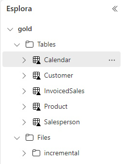

## Descrizione
Le pipeline basate sui metadati in Azure Data Factory, Synapse Pipelines e ora in Microsoft Fabric ti offrono la possibilità di inserire e trasformare i dati con meno codice, manutenzione ridotta e maggiore scalabilità rispetto alla scrittura di codice o pipeline per ogni entità di origine dati che deve essere ingerito e trasformato. La chiave sta nell'identificare i modelli di caricamento e trasformazione dei dati per le origini e le destinazioni dei dati e quindi creare la struttura per supportare ciascun modello.

## Creare le Azure Resource
Creare un Azure Resource Group, un Storage Account e l'Azure SQL DBs necessario. 
### Creare un Azure Resource group 

Se necessario, per creare il gruppo di risorse.
### Creare un Azure Storage account
Create un blob storage account nel resource group creato prima. Questo verrà utilizzato per ripristinare il database Wide World Importers.

### Creare un Azure SQL Server
La schermata dovrebbe essere simile a quella qui sotto: 
Andre sulla tab del  **Networking**  e modificare le Regole firewall in **Yes** per consentire ai servizi e alle risorse di Azure di accedere a questo server.

### Crea un Azure SQL DB per le configurazione della Metadata Driven Pipeline
1. seguire le istruzioni dell'immagine per la creazione 
2. usare come nome di database  **FabricMetadataOrchestration** 
3. Come **Workload environment** scegliere **Development**
4. Mentre nella scheda **Networking** sotto **Firewall rules**, aggiungere l'ip **Add current client IP address** to **Yes** 
5. Cliccare su **Review and create**
   
### Download e restore del database Wide World Importers Database
1. Download del database Wide World Importers per Azure SQL DB. [Click here to immediately download the bacpac](https://github.com/Microsoft/sql-server-samples/releases/download/wide-world-importers-v1.0/WideWorldImporters-Standard.bacpac)
1.Caricare il bacpac nello  storage account creato precedentemente e restore del database Wide World Importers. [Follow the instructions here](https://learn.microsoft.com/en-us/azure/azure-sql/database/database-import?view=azuresql&tabs=azure-powershell),

## Creare gli oggetti in Azure SQL DB
Prima le viste scaricando da qui lo script [in this repo](src/sql/1-wwi/create_source_views.sql). Dopo l'eseguzione degli script dobbiamo avere questa situazione 

### Caricare le tabelle del database che contiene i metadati
Scarichiamo ed eseguiamo lo script che trovate qui [in this repo](src/sql/2-metadatadb/create-metadata-tables.sql) Il risultato finale sarà il seguente: 
Notare i valori per le colonne **loadtype**, **sqlsourcedatecolumn**, **sqlstartdate** e **sqlenddate** della tabella **PipelineOrchestrator_FabricLakehouse**. Per le tabelle con **loadtype** uguale a '**incremental**', verranno caricati solo 1 settimana di dati. Questo perché queste tabelle sono molto grandi, quindi a scopo di test abbiamo bisogno solo di una piccola quantità di dati. Dopo che queste tabelle sono state caricate in Lakehouse, **sqlstartdate** verrà aggiornato alla data massima di ciascuna colonna indicata nella colonna sqlsourcedate per ogni tabella. Ciò significa che se esegui nuovamente la pipeline senza reimpostare **sqlenddate**, nessun nuovo dato verrà aggiunto alle tabelle caricate in modo incrementale. Potresti essere tentato di impostare **sqlenddate** su NULL, che è il valore per i carichi pianificati in produzione, ma ti metterei in guardia dal farlo in questa soluzione senza testare la durata del caricamento dal database World Wide Importers a Lakehouse corre. Aggiorna invece **sqlenddate** per aggiungere solo pochi giorni di dati in più dopo l'esecuzione iniziale dei dati di una sola settimana per testare la logica di caricamento incrementale.

## Creazione delle risorse di Microsoft Fabric 
Creazione di un workspace di Fabric, Lakehouses, Data Warehouse, e delle connessioni Azure SQL DB. Quindi bisogna prima creare un workspace di Fabric [Create a Fabric Workspace](https://learn.microsoft.com/en-us/fabric/get-started/create-workspaces) poi passeremo alla creazione di due lakehouse per il livello bronze e gold [Create 2 Microsoft Fabric Lakehouses](https://learn.microsoft.com/en-us/fabric/data-engineering/create-lakehouse) nel workspace. Dopo aver creato il lakehouse copiarsi il riferimento  URLsdelle tabelle come mostra sotto  dovrebbe essere una cosa simile **abfss://\<uniqueid>@onelake.dfs.fabric.microsoft.com/a\<anotheruniqueid>** .
Successivamente vi sarà la creazione del Fabric Data warehouse seguendo le indicazioni che si vedono nell'immagine sotto [istruzioni](https://learn.microsoft.com/en-us/fabric/data-warehouse/create-warehouse).

Abbiamo bisogno di un Data Warehouse perchè ,anche se le visualizzazioni possano essere create su Lakehouse in Fabric, queste visualizzazioni non sono esposte nell'attività di copia dati, almeno al momento della stesura di questo documento. Pertanto dobbiamo creare le viste nel Fabric Data Warehouse per entrambi i modelli. 

Prima di proseguire dobbiamo creare una connessione al database Wide World Importers e al FabricMetadataConfiguration seguendo queste istruzioni [istruzioni](https://learn.microsoft.com/en-us/fabric/data-factory/connector-azure-sql-database).

### Caricamento dei Notebooks Spark su Fabric
1. Scarica i 3 notebooks [dentro il repository](src/notebooks/)
2. **Import notebook** e poi selezionare i file da caricare 

## Creazione della Pipelines per caricare dati da World Wide Importers a Fabric Lakehouse
È importante copiare il testo esattamente così com'è per evitare errori negli script o nelle attività successive. Ecco un paio di esempi:

Le istruzioni sopra riportate ti dicono di andare nella pipeline **Parametri**, aggiungere 9 nuovi parametri di tipo stringa e copiare ciascun nome del parametro dalla tabella al nome di parametro nella pipeline.

Questa pipeline verrà chiamata da una pipeline Orchestrator per caricare una tabella dagli importatori mondiali a Fabric Lakehouse. Una volta terminata la pipeline sarà simile alla seguente: 

1. Crea una nuova Pipeline  e chiamala "**Get WWImporters Data direct**"
2. Aggiungi una attività  di **Set variable** 
3. Fare clic sull'area di disegno e aggiungere la seguente pipeline **Parameters**:

      Name                | Type   |
     ------------------- | ------ |
     sqlsourcedatecolumn | String |
     sqlstartdate        | String |
     sqlenddate          | String |
     sqlsourceschema     | String |
     sqlsourcetable      | String |
     sinktablename       | String |
     loadtype            | String |
     sourcekeycolumn     | String |
     batchloaddatetime   | String |

4.Spostati sulle  **Variables** come scheda e aggiungi le seguenti variabili: 

      Name              | Type   |
    | ----------------- | ------ |
    | datepredicate     | String |
    | maxdate           | String |
    | rowsinserted      | String |
    | rowsupdated       | String |
    | pipelinestarttime | String |
    | pipelineendtime   | String |
    
5. Configura l'attività di  **Set variable** creata al passo 2:

    | Tab      | Configuration | Value Type         | Value                 |
    | -------- | ------------- | ------------------ | --------------------- |
    | General  | Name          | String             | Set pipelinestarttime |
    | Settings | Variable type | Radio Button       | Pipeline variable     |
    | Settings | Name          | String             | pipelinestarttime     |
    | Settings | Value         | Dynamic Content | @utcnow()             |
   
6. Aggiugni un nuovo **Set variable**, e configuralo come segue:

    | Tab      | Configuration | Value Type   | Value              |
    | -------- | ------------- | ------------ | ------------------ |
    | General  | Name          | String       | Set Date predicate |
    | Settings | Variable type | Radio Button | Pipeline variable  |
    | Settings | Name          | String       | datepredicate      |
    | Settings | Value         | Dynamic Content |@if(equals(pipeline().parameters.sqlenddate,null),concat(pipeline().parameters.sqlsourcedatecolumn,' >= ''', pipeline().parameters.sqlstartdate,''''),concat(pipeline().parameters.sqlsourcedatecolumn, ' >= ''',pipeline().parameters.sqlstartdate,''' and ', pipeline().parameters.sqlsourcedatecolumn,' < ''',pipeline().parameters.sqlenddate,'''')) |
   
7. Aggiungi una attività di **If condition** e configuralo come segue:
    | Tab        | Configuration | Value Type         | Value                                          |
    | ---------- | ------------- | ------------------ | ---------------------------------------------- |
    | General    | Name          | String             | Check loadtype                                 |
    | Activities | Expression    | Dynamic Content | @equals(pipeline().parameters.loadtype,'full') |
   
8. Ora configura la parte dell' **If True**. Una volta completate, le attività di configurazione apparira così: 
    1. Aggiungi una attività di **Copy Data**  e configurala così:
          Tab     | Configuration   | Value Type   | Value                           |
        | ------- | --------------- | ------------ | ------------------------------- |
        | General | Name            | String       | Copy data to delta table        |
        | Source  | Data store type | Radio button | External                        |
        | Source  | Connection      | Drop down    | \<choose your World Wide Importers database connection> |
        | Source  | Connection type | Drop down    | Azure SQL Database              |
        | Source  | User query      | Radio button | Query                           |
        | Source  | Query           | Dynamic Content | select * from @{pipeline().parameters.sqlsourceschema}.@{pipeline().parameters.sqlsourcetable} where  @{variables('datepredicate')} |
        | Destination | Data store type           | Radio button       | Workspace                            |
        | Destination | Workspace data store type | Drop down          | Lakehouse                            |
        | Destination | Lakehouse                 | Drop down          | \<choose your Fabric Lakehouse>              |
        | Destination | Root folder               | Radio button       | Tables                               |
        | Destination | Table name                | Dynamic Content | @pipeline().parameters.sinktablename |
        | Destination | Advanced-> Table action   | Radio button       | Overwrite                            | 
    1.  Aggiungi una attività di **Notebook** e configurala così:
        | Tab      | Configuration               | Add New Parameter | Value Type         | Value                                      |
        | -------- | --------------------------- | ----------------- | ------------------ | ------------------------------------------ |
        | General  | Settings                    |                   | String             | Get MaxDate loaded                         |
        | Settings | Notebook                    |                   | Dropdown           | Get Max Data from Delta Table              |
        | Settings | Advanced -> Base parameters | lakehousePath     | String             | \<enter your Bronze Lakehouse abfss path>          |
        | Settings | Advanced -> Base parameters | tableName         | Dynamic Content | @pipeline().parameters.sinktablename       |
        | Settings | Advanced -> Base parameters | tableKey          | Dynamic Content | @pipeline().parameters.sourcekeycolumn     |
        | Settings | Advanced -> Base parameters | dateColumn        | Dynamic Content | @pipeline().parameters.sqlsourcedatecolumn |
   
    1. Aggiungi una attività di  **Set variable** e configurala così:
   
        | Tab      | Configuration | Value Type         | Value                                                                               |
        | -------- | ------------- | ------------------ | ----------------------------------------------------------------------------------- |
        | General  | Name          | String             | Get maxdate                                                                         |
        | Settings | Variable type | Radio Button       | Pipeline variable                                                                   |
        | Settings | Name          | Dropdown           | maxdate                                                                             |
        | Settings | Value         | Dynamic Content | @split(split(activity('Get MaxDate loaded').output.result.exitValue,'\|')[0],'=')[1] |
   
    1. Aggiungere una attività di **Set variable**,e configuralo come segue:
        | Tab      | Configuration | Value Type   | Value             |
        | -------- | ------------- | ------------ | ----------------- |
        | General  | Name          | String       | set rows inserted |
        | Settings | Variable type | Radio Button | Pipeline variable |
        | Settings | Name          | Dropdown     | rowsinserted      |
        | Settings | Value         | Dynamic Content | @split(split(activity('Get MaxDate loaded').output.result.exitValue,'\|')[1],'=')[1] |
   
    1. Aggiungere una attività di **Set variable**, e configuralo come segue:
        | Tab      | Configuration | Value Type         | Value                |
        | -------- | ------------- | ------------------ | -------------------- |
        | General  | Name          | String             | Set pipeline endtime |
        | Settings | Variable type | Radio Button       | Pipeline variable    |
        | Settings | Name          | Dropdown           | pipelineendtime      |
        | Settings | Value         | Dynamic Content | @utcnow()            |
   
     1. Aggiungere una attività di  **Script**, e configuralo come segue:
        | Tab      | Configuration   | Value Type   | Value                           |
        | -------- | --------------- | ------------ | ------------------------------- |
        | General  | Name            | String       | Update Pipeline Run details     |
        | Settings | Data store type | Radio Button | External                        |
        | Settings | Connection      | Dropdown     | Connection to FabricMetdataOrchestration Database |
        | Settings | Script          | Radio Button | NonQuery                        |
        | Settings | Script          | Dynamic Content  | Update dbo.PipelineOrchestrator_FabricLakehouse set batchloaddatetime = '@{pipeline().parameters.batchloaddatetime}', loadstatus = '@{activity('Copy data to delta table').output.executionDetails[0].status}', rowsread = @{activity('Copy data to delta table').output.rowsRead}, rowscopied= @{activity('Copy data to delta table').output.rowsCopied}, deltalakeinserted = '@{variables('rowsinserted')}', deltalakeupdated =0, sqlmaxdatetime = '@{variables('maxdate')}', pipelinestarttime='@{variables('pipelinestarttime')}', pipelineendtime = '@{variables('pipelineendtime')}' where sqlsourceschema = '@{pipeline().parameters.sqlsourceschema}' and sqlsourcetable = '@{pipeline().parameters.sqlsourcetable}' |
    
9. Ora configuriamo il ramo **If False** : 
    1. Aggiungere attività **Copy Data**:
        | Tab     | Configuration   | Value Type   | Value                           |
        | ------- | --------------- | ------------ | ------------------------------- |
        | General | Name            | String       | Copy data to parquet            |
        | Source  | Data store type | Radio button | External                        |
        | Source  | Connection      | Drop down    | \<choose your World Wide Importers database connection> |
        | Source  | Connection type | Drop down    | Azure SQL Database              |
        | Source  | User query      | Radio button | Query                           |
        | Source  | Query      | Dynamic Content | select * from @{pipeline().parameters.sqlsourceschema}.@{pipeline().parameters.sqlsourcetable} where  @{variables('datepredicate')} |
        | Destination | Data store type           | Radio button | Workspace               |
        | Destination | Workspace data store type | Drop down    | Lakehouse               |
        | Destination | Lakehouse                 | Drop down    | \<choose your Fabric Lakehouse> |
        | Destination | Root folder               | Radio button | Files                   |
        | Destination  | File Path (1)  | Dynamic Content | incremental/@{pipeline().parameters.sinktablename} |
        | Destination  | File Path (2)  | Dynamic Content | @{pipeline().parameters.sinktablename}.parquet |
        | Destination  | File format      | Drop down | Parquet |
    1. Aggiungere attività **Notebook** e configuralo come segue:
        | Tab      | Configuration               | Add New Parameter | Value Type         | Value                                      |
        | -------- | --------------------------- | ----------------- | ------------------ | ------------------------------------------ |
        | General  | Settings                    |                   | String             | Load to Delta                              |
        | Settings | Notebook                    |                   | Dropdown           | Create or Merge to Deltalake               |
        | Settings | Advanced -> Base parameters | lakehousePath     | String             | \<enter your Bronze Lakehouse abfss path>          |
        | Settings | Advanced -> Base parameters | tableName         | Dynamic Content | @pipeline().parameters.sinktablename       |
        | Settings | Advanced -> Base parameters | tableKey          | Dynamic Content | @pipeline().parameters.sourcekeycolumn     |
        | Settings | Advanced -> Base parameters | dateColumn        | Dynamic Content | @pipeline().parameters.sqlsourcedatecolumn |
    1. Aggiungere una attività di  **Set variable**, e configurarlo come segue:
        | Tab      | Configuration | Value Type         | Value                                                                          |
        | -------- | ------------- | ------------------ | ------------------------------------------------------------------------------ |
        | General  | Name          | String             | Get maxdate incr                                                               |
        | Settings | Variable type | Radio Button       | Pipeline variable                                                              |
        | Settings | Name          | Dropdown           | maxdate                                                                        |
        | Settings | Value         | Dynamic Content | @split(split(activity('Load to Delta').output.result.exitValue,'\|')[0],'=')[1] |
    1.  Aggiungere una attività di **Set variable**, e configurarlo come segue:
        | Tab      | Configuration | Value Type         | Value                                                                          |
        | -------- | ------------- | ------------------ | ------------------------------------------------------------------------------ |
        | General  | Name          | String             | set rows inserted incr                                                         |
        | Settings | Variable type | Radio Button       | Pipeline variable                                                              |
        | Settings | Name          | Dropdown           | rowsinserted                                                                   |
        | Settings | Value         | Dynamic Content | @split(split(activity('Load to Delta').output.result.exitValue,'\|')[1],'=')[1] |
    1. Aggiungere una attività di  **Set variable**, e configurarlo come segue:
        | Tab      | Configuration | Value Type         | Value                                                                          |
        | -------- | ------------- | ------------------ | ------------------------------------------------------------------------------ |
        | General  | Name          | String             | set rows updated incr                                                          |
        | Settings | Variable type | Radio Button       | Pipeline variable                                                              |
        | Settings | Name          | Dropdown           | rowsupdated                                                                    |
        | Settings | Value         | Dynamic Content | @split(split(activity('Load to Delta').output.result.exitValue,'\|')[2],'=')[1] |
    1. Aggiungere una attività di  **Set variable**, e configurarlo come segue:
        | Tab      | Configuration | Value Type         | Value                     |
        | -------- | ------------- | ------------------ | ------------------------- |
        | General  | Name          | String             | Set pipeline endtime incr |
        | Settings | Variable type | Radio Button       | Pipeline variable         |
        | Settings | Name          | Dropdown           | pipelineendtime           |
        | Settings | Value         | Dynamic Content | @utcnow()                 |
    1. Aggiungere una attività di  **Script** e configurarlo come segue:
        | Tab      | Configuration   | Value Type   | Value                                             |
        | -------- | --------------- | ------------ | ------------------------------------------------- |
        | General  | Name            | String       | Update Pipeline Run details - incremental         |
        | Settings | Data store type | Radio Button | External                                          |
        | Settings | Connection      | Dropdown     | Connection to FabricMetdataOrchestration Database |
        | Settings | Script(1)       | Radio Button | NonQuery                                          |
        | Settings | Script(2)       | Dynamic Content | Update dbo.PipelineOrchestrator_FabricLakehouse set batchloaddatetime = '@{pipeline().parameters.batchloaddatetime}', loadstatus = '@{activity('Copy data to parquet').output.executionDetails[0].status}', rowsread = @{activity('Copy data to parquet').output.rowsRead}, rowscopied= @{activity('Copy data to parquet').output.rowsCopied},deltalakeinserted = '@{variables('rowsinserted')}',deltalakeupdated = '@{variables('rowsupdated')}', sqlmaxdatetime = '@{variables('maxdate')}', sqlstartdate = '@{variables('maxdate')}', pipelinestarttime='@{variables('pipelinestarttime')}', pipelineendtime = '@{variables('pipelineendtime')}'  where sqlsourceschema = '@{pipeline().parameters.sqlsourceschema}' and sqlsourcetable = '@{pipeline().parameters.sqlsourcetable}' |

### Creazione della pipeline di Orchestration
Per eseguire la pipeline, creeremo una pipeline Orchestrator. Una pipeline Orchestrator è la pipeline principale che coordina il flusso e l'esecuzione di tutte le attività della pipeline, inclusa la chiamata ad altre pipeline. Una volta terminati i passaggi seguenti, la pipeline dell'orchestrator avrà il seguente aspetto: 
1. Crea una nuova pipeline di dati denominata **orchestrator Load WWI to Fabric**
1. Aggiungi una attività di **Set Variable**:
1. Fare clic sulla tela e creare quanto segue **Parameters**:
   | Name       | Type | Default Value | Description                                             |
   | ---------- | ---- | ------------- | ------------------------------------------------------- |
   | startyear  | int  | 2013          | Year to start loading from WWI                          |
   | endyear    | int  | 2025          | Year to end loading from WWI                            |
   | loaddwh    | int  | 0             | Set to 1 if you want to load to Fabric Data Warehouse   |
   | loadgoldlh | int  | 1             | Set to 1 if you want to load to Fabric Gold Lakehouse   |
   | loadbronze | int  | 1             | Set to 1 if you want to load to Fabric Bronze Lakehouse |
   | waittime | int  | 300            | Delay needed for tables to materialize in Bronze Lakehouse before loading to DW or Gold LH. Can set to 1 if not loading Bronze or only loading to Bronze |
1. Aggiungi delle  **Variables** delle pipeline
   | Name              | Type   |
   | ----------------- | ------ |
   | batchloaddatetime | String |
1.Ritornare nella attività dello step 2 cioè **Set variable** e configurarla come segue:
   | Tab      | Configuration | Value Type         | Value                   |
   | -------- | ------------- | ------------------ | ----------------------- |
   | General  | Name          | String             | set batch load datetime |
   | Settings | Variable type | Radio Button       | Pipeline variable       |
   | Settings | Name          | Dropdown           | batchloaddatetime       |
   | Settings | Value         | Dynamic Content | @pipeline().TriggerTime |
1. Aggiungi una attività di  **Lookup** e configurarla come segue:
   | Tab      | Configuration   | Value Type   | Value                                |
   | -------- | --------------- | ------------ | ------------------------------------ |
   | General  | Name            | String       | Get tables to load to deltalake      |
   | Settings | Data store type | Radio button | External                             |
   | Settings | Connection      | Drop down    | Connection to FabricMetdataOrchestration Database |
   | Settings | Connection Type | Drop down    | Azure SQL Database                   |
   | Settings | Use query       | Radio button | Query                                |
   | Settings | Query       | Dynamic Content |select * from dbo.PipelineOrchestrator_FabricLakehouse where skipload=0 and 1=@{pipeline().parameters.loadbronze} |
   | Settings | First row only      | Check box | Not Checked                                |
1. Aggiungi una attività di **For each** e configurarla come segue:
   | Tab        | Configuration | Value Type                                    | Value                                                     |
   | ---------- | ------------- | --------------------------------------------- | --------------------------------------------------------- |
   | General    | Name          | String                                        | For each table to load to deltalake                       |
   | Settings   | Batch count   | String                                        | 4                                                         |
   | Settings   | Items         | Dynamic Content                            | @activity('Get tables to load to deltalake').output.value |
                                                        
1. Clicchiamo sulla matitina della **Activities** nel blocco **For Each** e aggiungi una attività di  **Invoke Pipeline** configurata come segue:
   | Tab      | Configuration      | Parameter Name      | Value Type         | Value                           |
   | -------- | ------------------ | ------------------- | ------------------ | ------------------------------- |
   | General  | Name               |                     | String             | Get WWImporters Data            |
   | Settings | Invoked pipeline   |                     | Dropdown           | Get WWI Importers Data direct   |
   | Settings | Wait on completion |                     | Checkbox           | Checked                         |
   | Settings | Parameters         | sqlsourcedatecolumn | Dynamic Content | @item().sqlsourcedatecolumn     |
   | Settings | Parameters         | sqlstartdate        | Dynamic Content | @item().sqlstartdate            |
   | Settings | Parameters         | sqlenddate          | Dynamic Content | @item().sqlenddate              |
   | Settings | Parameters         | sqlsourceschema     | Dynamic Content | @item().sqlsourceschema         |
   | Settings | Parameters         | sqlsourcetable      | Dynamic Content | @item().sqlsourcetable          |
   | Settings | Parameters         | sinktablename       | Dynamic Content | @item().sinktablename           |
   | Settings | Parameters         | loadtype            | Dynamic Content | @item().loadtype                |
   | Settings | Parameters         | sourcekeycolumn     | Dynamic Content | @item().sourcekeycolumn         |
   | Settings | Parameters         | batchloaddatetime   | Dynamic Content | @variables('batchloaddatetime') |
1. Nella finestra principale aggiungi una attività di **Notebook** e configurala come segue:
   | Tab      | Configuration   | Add New Parameter | Parameter Type | Value Type         | Value                            |
   | -------- | --------------- | ----------------- | -------------- | ------------------ | -------------------------------- |
   | General  | Name            |                   |                | String             | Build Calendar                   |
   | Settings | Notebook        |                   |                | Dropdown           | Build Calendar                   |
   | Settings | Base parameters | startyear         | int            | Dynamic Content | @pipeline().parameters.startyear |
   | Settings | Base parameters | endyear           | int            | Dynamic Content | @pipeline().parameters.endyear   |
   | Settings | Base parameters | lakehousePath     | String         |String  | \<enter your Bronze Lakehouse abfss path>          |

Eseguire la pipeline Orchestrator per caricare Lakehouse. Una volta completato, dovresti vedere le seguenti tabelle e file nella tua Lakehouse: 

## Creazione del Silver Layer con le View
1. Scarica il file di script SQL del datawarehouse [caricato da qui](src/fabricdw/create-fabric-dw-views.sql).
1. Open the downloaded SQL script (create-fabric-dw-views.sql) using notepad and copy the entire contents of the script.
1. Dal portale Fabric, vai al tuo Fabric Workspace e apri il tuo Data Warehouse e [crea una nuova query](https://learn.microsoft.com/en-us/fabric/data-warehouse/query-warehouse).
1. Incolla il codice nella query Fabric Data Warehouse.
1. Esegui Trova e sostituisci **[Ctrl-H]** e sostituisci il testo  **myFTAFabricWarehouse** con il nome del vostro Fabric Warehouse.
1. Fai un altro Trova e sostituisci e sostituisci il testo **myFTAFabricLakehouse** con il nome del Fabric Lakehouse.
1. Esegui lo script della query SQL. Dopo aver eseguito lo script, dovresti vedere le seguenti view nello schema Silver del tuo Fabric Data Warehouse  

## Costruire il Gold Layer con il primo pattern (lakehouse)
## Create the pipeline to load data from Fabric Lakehouse to Gold Fabric Lakehouse
Una volta completata questa pipeline, sarà simile a questa: 

1. Crea una nuova pipeline di dati chiamata **Load Lakehouse Table**
2. Aggiungere una attività di **Set Variable**
3. Fare clic sulla tela e creare quanto segue **Parameters**:
    | Name              | Type   |
    | ----------------- | ------ |
    | sourcestartdate   | String |
    | sourceenddate     | String |
    | sourceschema      | String |
    | sourcetable       | String |
    | loadtype          | String |
    | batchloaddatetime | String |
    | sinktable         | String |
    | tablekey          | String |
    | tablekey2         | String |
4. Aggiungere le **Variables** della pipeline:
    | Name              | Type   |
    | ----------------- | ------ |
    | datepredicate     | String |
    | maxdate           | String |
    | rowsinserted      | String |
    | rowsupdated       | String |
    | pipelinestarttime | String |
    | pipelineendtime   | String |
5. Configurare l'attività **Set variable** aggiunta nel passo 2:
    | Tab      | Configuration | Value type         | Value                 |
    | -------- | ------------- | ------------------ | --------------------- |
    | General  | Name          | String             | Set pipelinestarttime |
    | Settings | Variable type | Radio Button       | Pipeline variable     |
    | Settings | Name          | String             | pipelinestarttime     |
    | Settings | Value         | Dynamic Content | @utcnow()             |
6. Aggiungere una attività di **If condition** e confiurala come segue:
    | Tab        | Configuration | Value type         | Value                                          |
    | ---------- | ------------- | ------------------ | ---------------------------------------------- |
    | General    | Name          | String             | Check loadtype                                 |
    | Activities | Expression    | Dynamic Content | @equals(pipeline().parameters.loadtype,'full') |
7.Ora configura  l' **If True** . Quando sarà completato comparirà così:
    1. Aggiungere una attività di  **Copy Data** e configurarla come segue:
    
        | Tab         | Configuration             | Value Type         | Value                               |
        | ----------- | ------------------------- | ------------------ | ----------------------------------- |
        | General     | Name                      | String             | Copy data to gold lakehouse         |
        | Source      | Data store type           | Radio Button       | Workspace                           |
        | Source      | Workspace data store type | Drop down          | Data Warehouse                      |
        | Source      | Data Warehouse            | Drop down          | \<choose your Fabric Data Warehouse>         |
        | Source      | Use query                 | Radio Button       | Table                               |
        | Source      | Table (Schema)            | Dynamic Content | @pipeline().parameters.sourceschema |
        | Source      | Table (Table name)        | Dynamic Content | @pipeline().parameters.sourcetable  |
        | Destination | Data store type           | Radio Button       | Workspace                           |
        | Destination | Workspace data store type | Drop down          | Lakehouse                           |
        | Destination | Lakehouse                 | Drop down          | \<choose your Fabric Gold Lakehouse>         |
        | Destination | Root folder               | Radio Button       | Tables                              |
        | Destination | Table (Table name)        | Dynamic Content | @pipeline().parameters.sinktable    |
        | Destination | Advanced -> Table action  | Radio Button       | Overwrite                           |
    1. Aggungere una attività di **Set variable** e configurarla come segue:
        | Tab      | Configuration | Value Type         | Value                |
        | -------- | ------------- | ------------------ | -------------------- |
        | General  | Name          | String             | Set pipeline endtime |
        | Settings | Variable type | Radio Button       | Pipeline variable    |
        | Settings | Name          | Dropdown           | pipelineendtime      |
        | Settings | Value         | Dynamic Content | @utcnow()            |
    1. Aggiungere una attività di **Script** e configurarla come segue:
        | Tab      | Configuration   | Value Type   | Value                                             |
        | -------- | --------------- | ------------ | ------------------------------------------------- |
        | General  | Name            | String       | Update Pipeline Run details                       |
        | Settings | Data store type | Radio Button | External                                          |
        | Settings | Connection      | Dropdown     | Connection to FabricMetdataOrchestration Database |
        | Settings | Script(1)       | Radio Button | NonQuery                                          |
        | Settings | Script(2)       | Dynamic Content | Update dbo.PipelineOrchestrator_FabricLakehouseGold set batchloaddatetime = '@{pipeline().parameters.batchloaddatetime}', loadstatus = '@{activity('Copy data to gold lakehouse').output.executionDetails[0].status}',  rowscopied= @{activity('Copy data to gold lakehouse').output.rowsCopied},deltalakeinserted= @{activity('Copy data to gold lakehouse').output.rowsCopied}, rowsread= @{activity('Copy data to gold lakehouse').output.rowsRead}, pipelinestarttime='@{variables('pipelinestarttime')}', pipelineendtime = '@{variables('pipelineendtime')}' where sourceschema = '@{pipeline().parameters.sourceschema}' and sourcetable = '@{pipeline().parameters.sourcetable}'  |
1. Ora configura la parte dell'**If False**. Alla fine della configurazione dovrà essere come questa immagine: 

    1. Aggiungere una attività **Set variable** e configurarla come segue:
        | Tab      | Configuration | Value Type   | Value              |
        | -------- | ------------- | ------------ | ------------------ |
        | General  | Name          | String       | Set date predicate |
        | Settings | Variable type | Radio Button | Pipeline variable  |
        | Settings | Name          | String       | datepredicate      |
        | Settings | Value          |Dynamic Content     | @if(equals(pipeline().parameters.sourceenddate,null),concat('LastUpdated >= ''', pipeline().parameters.sourcestartdate,''''),concat('LastUpdated >= ''',pipeline().parameters.sourcestartdate,''' and LastUpdated < ''',pipeline().parameters.sourceenddate,''''))    |
    1. Aggiungere una attività di  **Copy Data** e configurarla come segue:
        | Tab     | Configuration             | Value Type   | Value                          |
        | ------- | ------------------------- | ------------ | ------------------------------ |
        | General | Name                      | String       | Get incremental fact data      |
        | Source  | Data store type           | Radio button | Workspace                      |
        | Source  | Workspace data store type | Drop down    | Data Warehouse                 |
        | Source  | Data Warehouse            | Drop down    | \<choose your Fabric Data Warehouse> |
        | Source  | Use query                 | Radio button | Query                          |
        | Source  | Query               | Dynamic Content | select * from @{pipeline().parameters.sourceschema}.@{pipeline().parameters.sourcetable} where @{variables('datepredicate')} |
        | Destination | Data store type           | Radio button       | Workspace                                      |
        | Destination | Workspace data store type | Drop down          | Lakehouse                                      |
        | Destination | Lakehouse                 | Drop down          | \<choose your Fabric Gold lakehouse>                   |
        | Destination | Root folder               | Radio button       | Files                                          |
        | Destination | File Path (1)             | Dynamic Content | incremental/@{pipeline().parameters.sinktable} |
        | Destination | File Path (2)             | Dynamic Content | @{pipeline().parameters.sinktable}.parquet     |
        | Destination | File format               | Drop down          | Parquet                                        |
    1. Aggiungere una attività di  **Notebook** e configurarla come segue:
        | Tab      | Configuration               | Add New Parameter | Value Type         | Value                            |
        | -------- | --------------------------- | ----------------- | ------------------ | -------------------------------- |
        | General  | Settings                    |                   | String             | Merge to Gold                    |
        | Settings | Notebook                    |                   | Dropdown           | Create or Merge to Deltalake     |
        | Settings | Advanced -> Base parameters | lakehousePath     | String             | \<enter your Gold Lakehouse abfss path>  |
        | Settings | Advanced -> Base parameters | tableName         | Dynamic Content | @pipeline().parameters.sinktable |
        | Settings | Advanced -> Base parameters | tableKey          | Dynamic Content | @pipeline().parameters.tablekey  |
        | Settings | Advanced -> Base parameters | tableKey2         | Dynamic Content | @pipeline().parameters.tablekey2 |
        | Settings | Advanced -> Base parameters | dateColumn        | String             | LastUpdated                      |
    1. Aggiungere una attività di   **Set variable** e configurarla come segue:
        | Tab      | Configuration | Value Type         | Value                                                                          |
        | -------- | ------------- | ------------------ | ------------------------------------------------------------------------------ |
        | General  | Name          | String             | Get maxdate incr                                                               |
        | Settings | Variable type | Radio Button       | Pipeline variable                                                              |
        | Settings | Name          | Dropdown           | maxdate                                                                        |
        | Settings | Value         | Dynamic Content | @split(split(activity('Merge to Gold').output.result.exitValue,'\|')[0],'=')[1] |
    1. Aggiungere una attività di **Set variable** e configurarla come segue:
        | Tab      | Configuration | Value Type         | Value                                                                          |
        | -------- | ------------- | ------------------ | ------------------------------------------------------------------------------ |
        | General  | Name          | String             | set rows inserted incr                                                         |
        | Settings | Variable type | Radio Button       | Pipeline variable                                                              |
        | Settings | Name          | Dropdown           | rowsinserted                                                                   |
        | Settings | Value         | Dynamic Content | @split(split(activity('Merge to Gold').output.result.exitValue,'\|')[1],'=')[1] |
    1. Aggiungere una attività di  **Set variable** e configurarla come segue:
        | Tab      | Configuration | Value Type         | Value                                                                          |
        | -------- | ------------- | ------------------ | ------------------------------------------------------------------------------ |
        | General  | Name          | String             | set rows updated incr                                                          |
        | Settings | Variable type | Radio Button       | Pipeline variable                                                              |
        | Settings | Name          | Dropdown           | rowsupdated                                                                    |
        | Settings | Value         | Dynamic Content | @split(split(activity('Merge to Gold').output.result.exitValue,'\|')[2],'=')[1] |
    1. Aggiungere una attività di  **Set variable** e configurarla come segue:
        | Tab      | Configuration | Value Type         | Value                     |
        | -------- | ------------- | ------------------ | ------------------------- |
        | General  | Name          | String             | Set pipeline endtime incr |
        | Settings | Variable type | Radio Button       | Pipeline variable         |
        | Settings | Name          | Dropdown           | pipelineendtime           |
        | Settings | Value         | Dynamic Content | @utcnow()                 |
    1.  Aggiungere una attività di  **Script** e configurarla come segue::
        | Tab      | Configuration   | Value Type   | Value                                             |
        | -------- | --------------- | ------------ | ------------------------------------------------- |
        | General  | Name            | String       | Update Pipeline Run details - incremental         |
        | Settings | Data store type | Radio Button | External                                          |
        | Settings | Connection      | Dropdown     | Connection to FabricMetdataOrchestration Database |
        | Settings | Script(1)       | Radio Button | NonQuery                                          |
        | Settings | Script(1)       | Dynamic Content | Update dbo.PipelineOrchestrator_FabricLakehouseGold set batchloaddatetime = '@{pipeline().parameters.batchloaddatetime}', loadstatus = '@{activity('Get incremental fact data').output.executionDetails[0].status}', rowsread = @{activity('Get incremental fact data').output.rowsRead}, rowscopied= @{activity('Get incremental fact data').output.rowsCopied},deltalakeinserted = '@{variables('rowsinserted')}',deltalakeupdated = '@{variables('rowsupated')}', sinkmaxdatetime = '@{variables('maxdate')}', sourcestartdate = '@{variables('maxdate')}', pipelinestarttime='@{variables('pipelinestarttime')}', pipelineendtime = '@{variables('pipelineendtime')}'  where sourceschema = '@{pipeline().parameters.sourceschema}' and sourcetable = '@{pipeline().parameters.sourcetable}'|

## Configurazione della pipeline che fa da orchestrator
Ora dobbiamo modificare la pipeline che fa da Orchestrator, **orchestrator Load WWI to Fabric**. Una volta terminato, la pipeline dovrebbe assomigliare a questa: 

1. Possono essere necessari fino a 5 minuti dal momento in cui viene creata una tabella in Fabric Lakehouse affinché sia disponibile in un endpoint. Quindi aggiungeremo un'attività **Wait**.:
    | Tab      | Configuration        | Value Type         | Value                           |
    | -------- | -------------------- | ------------------ | ------------------------------- |
    | General  | Name                 | String             | Delay gold load                 |
    | Settings | Wait time in seconds | Dynamic Content | @pipeline().parameters.waittime |
1. Aggiungere una attività di  **Lookup** e configurala come segue:
    | Tab      | Configuration   | Value Type         | Value                                                                                                                    |
    | -------- | --------------- | ------------------ | ------------------------------------------------------------------------------------------------------------------------ |
    | General  | Name            | String             | Get tables to load to gold lakehouse                                                                                     |
    | Settings | Data store type | Radio button       | External                                                                                                                 |
    | Settings | Connection      | Drop down          | Connection to FabricMetdataOrchestration Database  |
    | Settings | Connection Type | Drop down          | Azure SQL Database                                                                                                       |
    | Settings | Use query       | Radio button       | Query                                                                                                                    |
    | Settings | Query           | Dynamic Content | select \* from dbo.PipelineOrchestrator_FabricLakehouseGold where skipload=0 and @{pipeline().parameters.loadgoldlh} = 1 |
    | Settings | First row only  | Check box          | Not Checked                                                                                                              |
1. Aggiungere una attività di  **For each** e configurala come segue:
    | Tab        | Configuration | Value Type                                    | Value                                                          |
    | ---------- | ------------- | --------------------------------------------- | -------------------------------------------------------------- |
    | General    | Name          | String                                        | For each table to load to gold lakehouse                       |
    | Settings   | Items         | Dynamic Content                            | @activity('Get tables to load to gold lakehouse').output.value |
1. Clicca nella matita dell'attività **Activities** nel blocco **For Each** e aggiungi una attività di **Invoke Pipeline** e configurala come segue:
    | Tab      | Configuration      | Parameter Name    | Value Type         | Value                           |
    | -------- | ------------------ | ----------------- | ------------------ | ------------------------------- |
    | General  | Name               |                   | String             | Invoke Load Gold Lakehouse      |
    | Settings | Invoked pipeline   |                   | Dropdown           | Load Lakehouse Table            |
    | Settings | Wait on completion |                   | Checkbox           | Checked                         |
    | Settings | Parameters         | sourceenddate     | Dynamic Content | @item().sourceenddate           |
    | Settings | Parameters         | sourceschema      | Dynamic Content | @item().sourceschema            |
    | Settings | Parameters         | sourcetable       | Dynamic Content | @item().sourcetable             |
    | Settings | Parameters         | loadtype          | Dynamic Content | @item().loadtype                |
    | Settings | Parameters         | batchloaddatetime | Dynamic Content | @variables('batchloaddatetime') |
    | Settings | Parameters         | sinktable         | Dynamic Content | @item().sinktable               |
    | Settings | Parameters         | tablekey          | Dynamic Content | @item().tablekey                |
    | Settings | Parameters         | Tablekey2         | Dynamic Content | @item().tablekey2               |

Il risultato finale dovrebbe essere come lo schema seguente: 
Dopo aver fatto girare la pipeline dovremmoa vere la seguente situazione all'interno del lakehouse: 

## Costruire il Gold Layer con il secondo pattern (datawarehouse)
## Creazione la pipeline che carica i dati dal Fabric Data Warehouse al Gold Layer
Scarica il file di script SQL del datawarehouse [posizionati qui](src/fabricdw/create-fabric-dw-objects.sql).
1. Apri lo script SQL scaricato (create-fabric-dw-objects.sql) utilizzando il blocco note e copia l'intero contenuto dello script.
1. Dal portale Fabric, vai al tuo Fabric Workspace e apri il tuo Data Warehouse e [crei una nuova query](https://learn.microsoft.com/en-us/fabric/data-warehouse/query-warehouse).
1. Incolla il codice nella query Fabric Data Warehouse.
1. Esegui Trova e sostituisci **[Ctrl-H]** e sostituisci il testo **myFTAFabricWarehouse** con il nome Fabric Warehouse.
1. Fai un altro Trova e sostituisci e sostituisci il testo **myFTAFabricLakehouse** con il nome del Fabric Lakehouse.
1. Esegui lo script della query SQL. Dopo aver eseguito lo script, dovresti vedere le seguenti tabelle e store procedure nello schema Gold del tuo Fabric Data Warehouse:  

## Crea la pipeline da caricare da Fabric Lakehouse al Gold Data Warehouse

Una volta completata la pipeline, apparirà così: 

1. Create a new Data Pipeline called **Load Warehouse Table**
1. Add a **Set Variable** activity
1. Click on the canvas and create the following **Parameters**:
    | Name              | Type   |
    | ----------------- | ------ |
    | sourcestartdate   | String |
    | sourcestartdate   | String |
    | sourceenddate     | String |
    | sourceschema      | String |
    | sourcetable       | String |
    | sinkschema        | String |
    | loadtype          | String |
    | batchloaddatetime | String |
    | sinktable         | String |
    | storedprocschema  | String |
    | storedprocname    | String |
1. Add the following pipeline **Variables**:
    | Name              | Type   |
    | ----------------- | ------ |
    | pipelinestarttime | String |
    | pipelineendtime   | String |
1. Configure the **Set variable** activity created in step 2:
    | Tab      | Configuration | Value type         | Value                 |
    | -------- | ------------- | ------------------ | --------------------- |
    | General  | Name          | String             | Set pipelinestarttime |
    | Settings | Variable type | Radio Button       | Pipeline variable     |
    | Settings | Name          | String             | pipelinestarttime     |
    | Settings | Value         | Dynamic Content | @utcnow()             |
1. Add **If condition** activity, drag the green arrow from the previous activity to it and configure:
    | Tab        | Configuration | Value type         | Value                                          |
    | ---------- | ------------- | ------------------ | ---------------------------------------------- |
    | General    | Name          | String             | Check loadtype                                 |
    | Activities | Expression    | Dynamic Content | @equals(pipeline().parameters.loadtype,'full') |
1. Now configure the **If True** activities. Like the previous pipelines, the True activities will be a flow of activities when the table to be loaded should be a full load. When completed, the True activities will look like this:
    1. Add **Copy Data** activity and configure:
        | Tab         | Configuration               | Value Type         | Value                                                                              |
        | ----------- | --------------------------- | ------------------ | ---------------------------------------------------------------------------------- |
        | General     | Name                        | String             | Copy data to warehouse                                                             |
        | Source      | Data store type             | Radio Button       | Workspace                                                                          |
        | Source      | Workspace data store type   | Drop down          | Data Warehouse                                                                     |
        | Source      | Data Warehouse              | Drop down          | \<choose your Fabric Data Warehouse>                                 |
        | Source      | Use query                   | Radio Button       | Table                                                                              |
        | Source      | Table (Schema)              | Dynamic Content | @pipeline().parameters.sourceschema                                                |
        | Source      | Table (Table name)          | Dynamic Content | @pipeline().parameters.sourcetable                                                 |
        | Destination | Data store type             | Radio Button       | Workspace                                                                          |
        | Destination | Workspace data store type   | Drop down          | Dara Warehouse                                                                     |
        | Destination | Data Warehouse              | Drop down          | \<choose your Fabric Data Warehouse>                                                  |
        | Destination | Table Option                | Radio Button       | Use existing                                                                       |
        | Destination | Table (Schema)              | Dynamic Content | @pipeline().parameters.sinkschema                                                  |
        | Destination | Table (Table name)          | Dynamic Content | @pipeline().parameters.sinktable                                                   |
        | Destination | Advanced -> Pre-copy Script | Dynamic Content | DELETE FROM @{pipeline().parameters.sinkschema}.@{pipeline().parameters.sinktable} |
    1. Add **Set variable** activity, drag the green arrow from the previous activity to it and configure:
        | Tab      | Configuration | Value Type         | Value                |
        | -------- | ------------- | ------------------ | -------------------- |
        | General  | Name          | String             | Set pipeline endtime |
        | Settings | Variable type | Radio Button       | Pipeline variable    |
        | Settings | Name          | Dropdown           | pipelineendtime      |
        | Settings | Value         | Dynamic Content | @utcnow()            |
    1. Add **Script** activity, drag the green arrow from the previous activity to it and configure:
       | Tab      | Configuration   | Value Type   | Value                                             |
       | -------- | --------------- | ------------ | ------------------------------------------------- |
       | General  | Name            | String       | Update Pipeline Run details                       |
       | Settings | Data store type | Radio Button | External                                          |
       | Settings | Connection      | Dropdown     | Connection to FabricMetdataOrchestration Database |
       | Settings | Script(1)       | Radio Button | NonQuery                                          |
       | Settings | Script(2)       | Dynamic Content  | Update dbo.PipelineOrchestrator_FabricWarehouse set batchloaddatetime = '@{pipeline().parameters.batchloaddatetime}', loadstatus = '@{activity('Copy data to warehouse').output.executionDetails[0].status}',  rowsinserted= @{activity('Copy data to warehouse').output.rowsCopied}, rowsupdated=0, pipelinestarttime='@{variables('pipelinestarttime')}', pipelineendtime = '@{variables('pipelineendtime')}' where sourceschema = '@{pipeline().parameters.sourceschema}' and sourcetable = '@{pipeline().parameters.sourcetable}'   |
    1. Exit the **True activities** box of the **If condition** by clicking on  **Main canvas** in the upper left corner
1. Now configure the **If False** activities. Your False activities will be a flow of activities when the table to be loaded should be an incremental load. When completed, the False activities will look like this: 
    1. Add **Lookup** activity and configure:
        | Tab      | Configuration               | New parameter name | Paramater Type | Value Type         | Value                                                                             |
        | -------- | --------------------------- | ------------------ | -------------- | ------------------ | --------------------------------------------------------------------------------- |
        | General  | Name                        |                    |                | String             | Load Incremental via Stored Proc                                                  |
        | Settings | Data store type             |                    |                | Radio button       | Workspace                                                                         |
        | Settings | Workspace data store type   |                    |                | Drop down          | \<choose your Fabric Data Warehouse>    |
        | Settings | Use query                   |                    |                | Radio button       | Stored procedure                                                                  |
        | Settings | Stored procedure name       |                    |                | Dynamic Content | @{pipeline().parameters.storedprocschema}.@{pipeline().parameters.storedprocname} |
        | Settings | Stored procedure parameters | EndDate            | DateTime       | Dynamic Content | @pipeline().parameters.sourceenddate                                              |
        | Settings |                             | StartDate          | DateTime       | Dynamic Content | @pipeline().parameters.sourcestartdate                                            |
        | Settings | First row only              |                    |                | Check box          | Checked                                                                           |
    1. Add **Set variable** activity, drag the green arrow from the previous activity to it and configure:
        | Tab      | Configuration | Value Type         | Value                     |
        | -------- | ------------- | ------------------ | ------------------------- |
        | General  | Name          | String             | Set pipeline endtime_incr |
        | Settings | Variable type | Radio Button       | Pipeline variable         |
        | Settings | Name          | Dropdown           | pipelineendtime           |
        | Settings | Value         | Dynamic Content | @utcnow()                 |
    1. Add **Script** activity, drag the green arrow from the previous activity to it and configure:
        | Tab      | Configuration   | Value Type   | Value                                             |
        | -------- | --------------- | ------------ | ------------------------------------------------- |
        | General  | Name            | String       | Update Pipeline Run details_incr                  |
        | Settings | Data store type | Radio Button | External                                          |
        | Settings | Connection      | Dropdown     | Connection to FabricMetdataOrchestration Database |
        | Settings | Script(1)       | Radio Button | NonQuery                                          |
        | Settings | Script(2)       | Dynamic Content | Update dbo.PipelineOrchestrator_FabricWarehouse set batchloaddatetime = '@{pipeline().parameters.batchloaddatetime}', loadstatus = 'Succeeded', sinkmaxdatetime = '@{activity('Load Incremental via Stored Proc').output.firstRow.MaxDate}', sourcestartdate = '@{activity('Load Incremental via Stored Proc').output.firstRow.MaxDate}', rowsupdated = @{activity('Load Incremental via Stored Proc').output.firstRow.UpdateCount}, rowsinserted = @{activity('Load Incremental via Stored Proc').output.firstRow.InsertCount},  pipelinestarttime='@{variables('pipelinestarttime')}', pipelineendtime = '@{variables('pipelineendtime')}' where sourceschema = '@{pipeline().parameters.sourceschema}' and sourcetable = '@{pipeline().parameters.sourcetable}'  |
    1. Exit the **False activities** box of the **If condition** by clicking on  **Main canvas** in the upper left corner
## Configure the Orchestrator Pipeline to load from Fabric Lakehouse to Fabric Data Warehouse
Update the Orchestrator pipeline, **orchestrator Load WWI to Fabric**, to load data from the first Fabric Lakehouse to the Data Warehouse. When you are done, your pipeline should look like this: 
1. It can take up to 5 minutes from the time a table is created in the Fabric Lakehouse for it to be available in an endpoint. So we'll add a **Wait** activity. Drag the green arrow from the Build Calendar **Notebook** activity to it and configure:
    | Tab      | Configuration        | Value Type         | Value                           |
    | -------- | -------------------- | ------------------ | ------------------------------- |
    | General  | Name                 | String             | Delay gold load                 |
    | Settings | Wait time in seconds | Dynamic Content | @pipeline().parameters.waittime |
1. Add a **Lookup** activity.  Drag the green arrow from the **Wait** activity to it and configure:
    | Tab      | Configuration   | Value Type         | Value                                                                                                            |
    | -------- | --------------- | ------------------ | ---------------------------------------------------------------------------------------------------------------- |
    | General  | Name            | String             | Get tables to load to warehouse                                                                                  |
    | Settings | Data store type | Radio button       | External                                                                                                         |
    | Settings | Connection      | Drop down          | Connection to FabricMetdataOrchestration Database                                      |
    | Settings | Connection Type | Drop down          | Azure SQL Database                                                                                               |
    | Settings | Use query       | Radio button       | Query                                                                                                            |
    | Settings | Query           | Dynamic Content | select \* from dbo.PipelineOrchestrator_FabricWarehouse where skipload=0 and @{pipeline().parameters.loaddwh} =1 |
    | Settings | First row only  | Check box          | Not Checked                                                                                                      |
1. Add **For each** activity, drag the green arrow from the previous activity to it and configure:
    | Tab        | Configuration | Value Type                                    | Value                                                     |
    | ---------- | ------------- | --------------------------------------------- | --------------------------------------------------------- |
    | General    | Name          | String                                        | For each table to load to warehouse                       |
    | Settings   | Items         | Dynamic Content                            | @activity('Get tables to load to warehouse').output.value |
1. Click on the pencil in the **Activities** box of the **For each** and add an **Invoke Pipeline** activity and configure as follows:
    | Tab      | Configuration      | Parameter Name    | Value Type         | Value                           |
    | -------- | ------------------ | ----------------- | ------------------ | ------------------------------- |
    | General  | Name               |                   | String             | Invoke Load Warehouse Table     |
    | Settings | Invoked pipeline   |                   | Dropdown           | Load Warehouse Table            |
    | Settings | Wait on completion |                   | Checkbox           | Checked                         |
    | Settings | Parameters         | sourcestartdate   | Dynamic Content | @item().sourcestartdate         |
    | Settings | Parameters         | sourceenddate     | Dynamic Content | @item().sourceenddate           |
    | Settings | Parameters         | sourceschema      | Dynamic Content | @item().sourceschema            |
    | Settings | Parameters         | sourcetable       | Dynamic Content | @item().sourcetable             |
    | Settings | Parameters         | sinkschema        | Dynamic Content | @item().sinkschema              |
    | Settings | Parameters         | loadtype          | Dynamic Content | @item().loadtype                |
    | Settings | Parameters         | batchloaddatetime | Dynamic Content | @variables('batchloaddatetime') |
    | Settings | Parameters         | sinktable         | Dynamic Content | @item().sinktable               |
    | Settings | Parameters         | storedprocschema  | Dynamic Content | @item().storedprocschema        |
    | Settings | Parameters         | storedprocname    | Dynamic Content | @item().storedprocname          |
1. Exit the **Activities** box in the **For each** activity by clicking on  **Main canvas** in the upper left corner
 Save the **orchestrator Load WWI to Fabric** pipeline. Let's run it. If you already ran the pipelines to load to the the Fabric Lakeshouse, just run the load from the first or "Bronze" Lakehouse to the Data Warehouse. 

Your done! You have completed an End-to-End Metadata Driven Pipeline in Fabric!

